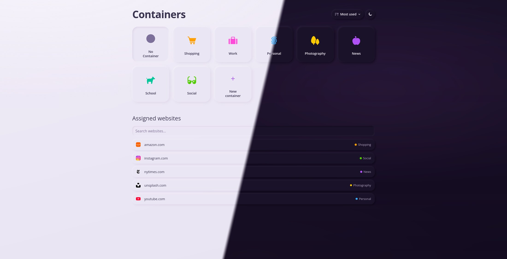

[![Badge Release]][Release]
[![Badge License]][License]
[![Badge Mozilla]][Mozilla]

---

<h1 align="center">
<sub>

</sub>
Containers New Tab
</h1>



[Multi-Account Containers](https://addons.mozilla.org/firefox/addon/multi-account-containers/) is great - until you want a new tab in the right one. Hunting the toolbar icon, misclicking or remembering which sites belong where gets old fast. This extension turns every new tab into a clear overview: open a container in one click, see which sites are already assigned, and create or edit containers, including proxy configurations, without leaving the page.

---

## Installation

Install from [Firefox Add-ons][Mozilla]. You'll want [Multi-Account Containers](https://addons.mozilla.org/firefox/addon/multi-account-containers/) installed too - site assignments are read from MAC.

[](https://addons.mozilla.org/firefox/addon/containers-new-tab/)

## Development

**Local**

```bash
npm install

# Vite HMR for the new-tab UI
npm run dev

# build + web-ext run (needs Firefox + display)
npm start

npm run build
```

**Firefox automation (Xpra + Selenium)**

The devcontainer uses morgh's Firefox and Xpra features. Selenium is an npm dev
dependency; Selenium Manager downloads and caches geckodriver on first use.
The first session also downloads Multi-Account Containers. Internet access is
needed for these initial downloads.

```bash
npm install

# Xpra normally starts through its feature hook; if no session is running:
xpra start :100 --daemon=yes --exit-with-children=no

# Build and run the browser smoke test, then close the test browser
npm run test:firefox

# Or run without a display
HEADLESS=1 npm run test:firefox
```

To watch from the host:

```bash
xpra attach ssh://containers-new-tab.devvm/100
```

For interactive development, run `npm run dev:firefox`. It starts Vite and the
existing `npm run firefox` script through concurrently, waiting for the HMR
extension build before launching Firefox. Input goes to the Firefox prompt;
`.exit` stops both processes. If Vite is already running, use `npm run firefox`
on its own. The Node prompt exposes `driver`, `By`, and `until`:

```js
await driver.getTitle()
await driver.findElement(By.css('[aria-label="New container"]')).click()
await driver.executeScript('return document.body.innerText')
```

Concurrently's settings live in root `dev.ts`; Firefox helpers live in `.scripts/`.
Node 24 runs these TypeScript files directly, and `npm run typecheck` checks them.

Use `.exit` to close the automated browser. Each session gets a fresh, isolated
profile with MAC installed; it does not reuse your manually opened Firefox.
The Xpra server stays running. Background-script changes require restarting the
Selenium session. The smoke test saves `.cache/firefox/smoke.png`.

`DISPLAY` defaults to `:100`; `FIREFOX_BIN` defaults to `/usr/bin/firefox`.
Reusable automation can import `createFirefoxSession` from
`.scripts/firefox-session.ts` and must call `driver.quit()` when finished.
WebDriver BiDi is enabled for further console/network inspection tooling.

To start from an existing profile:

```bash
FIREFOX_PROFILE=.web-ext-profile npm run dev:firefox
```

Selenium copies that profile for the session; changes are not saved back to the
original. The launcher reuses the startup tab, loading Firefox's configured
new-tab URL there only when the extension is not already rendered.

**Lint**

```bash
npm run lint       # prettier + oxlint
npm run lint:fix   # autofix
```

**Test**

```bash
npm test
npm run test:watch
npm run test:coverage
```

**Publish**

```bash
npm run package   # outputs web-ext-artifacts/*.zip
```

Listed releases go out from GitHub Actions on push to `main`.

## License

[MIT](LICENSE)

<!----------------------------------------------------------------------------->

[Release]: https://github.com/shotor/containers-new-tab/actions/workflows/release.yml
[License]: LICENSE
[Mozilla]: https://addons.mozilla.org/addon/containers-new-tab/
[Badge Release]: https://github.com/shotor/containers-new-tab/actions/workflows/release.yml/badge.svg
[Badge License]: https://img.shields.io/badge/License-MIT-blue.svg
[Badge Mozilla]: https://img.shields.io/amo/rating/containers-new-tab?label=Firefox
