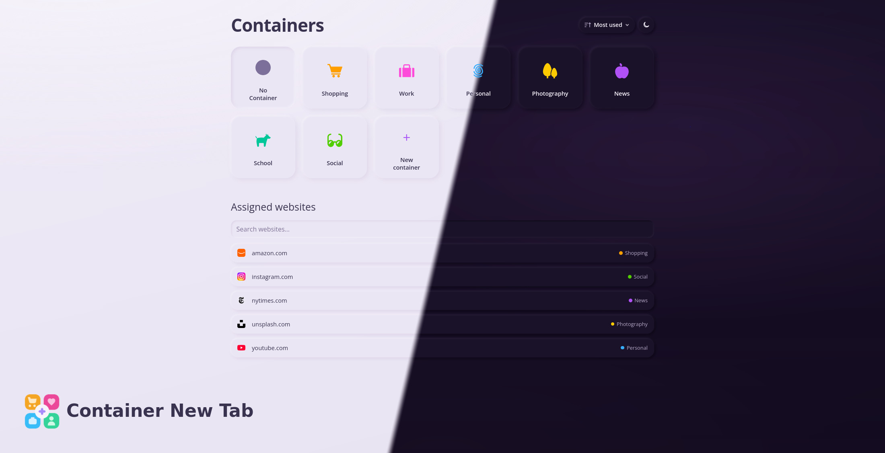

# Containers Tab

[](https://github.com/shotor/containers-new-tab/actions/workflows/release.yml)

Replace Firefox’s new tab and homepage with a container picker that feels like home — open the right container in one click, see where your sites belong, and edit containers without leaving the page.

Built for [Multi-Account Containers](https://addons.mozilla.org/firefox/addon/multi-account-containers/).

[Install on Firefox Add-ons](https://addons.mozilla.org/firefox/addon/containers-tab/)



## Development

**Local**

```bash
npm install
npm run dev     # Vite HMR for the new-tab UI
npm start       # build + web-ext run (needs Firefox + display)
npm run build
```

**Devcontainer**

Rebuild the container, then:

```bash
npm install
npm run test:firefox   # Firefox + noVNC
```

Open forwarded port **6080** → `/vnc.html` → Connect.

**Lint**

```bash
npm run lint       # prettier + oxlint
npm run lint:fix   # autofix
```

**Test**

```bash
npm test
npm run test:watch
npm run test:coverage
```

## License

[MIT](LICENSE)
